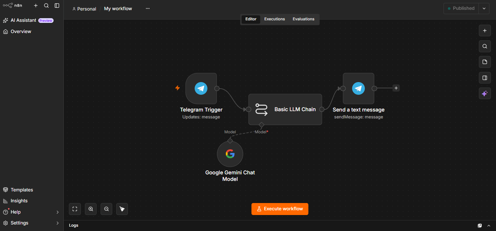

# 🤖 AI-Powered Telegram Chatbot using n8n & Google Gemini

An automated Telegram bot that leverages **n8n**, **Google Gemini API**, and **ngrok** to provide intelligent, real-time responses to user messages. 

---

## 🧐 How It Works
1. **Telegram Trigger:** When a user sends a message to the Telegram bot, Telegram generates a real-time event.
2. **Webhook & Tunneling:** Since the project runs locally (`localhost:5678`), `ngrok` establishes a secure public HTTPS tunnel to deliver Telegram's requests to your local n8n workflow.
3. **AI Processing:** The incoming message is sent to the **Google Gemini API**, which processes the input and generates an intelligent response.
4. **Automated Response:** The generated AI output is automatically sent back to the user on Telegram.

---

## ✨ Key Features & Capabilities
* **Real-time AI Chat:** Instant, context-aware replies to any user message.
* **Custom Prompts & Personality:** Adaptable into a customer support agent or specialized virtual assistant.
* **Scalable Automation:** Ready to integrate with Google Sheets, Notion, or databases.
* **Secure Local Testing:** Seamless webhook testing via ngrok tunneling.

---

## 🛠️ Tech Stack
* **Workflow Automation:** n8n (Low-code platform)
* **AI Model:** Google Gemini API
* **Messaging Platform:** Telegram Bot API
* **Tunneling:** ngrok

---

## 💡 Benefits & Portfolio Value
* **Practical Problem Solving:** Mastered local environment tunneling, webhook setups, and API integrations.
* **Professional Portfolio Asset:** Demonstrates modern AI and workflow automation skills on GitHub.
* **24/7 Availability:** Functions as a continuous, automated response system.

* ---

## 📷 Workflow Architecture & Preview

*(You can import the included `workflow1.json` or `My workflow.json` file directly into your n8n instance to use this workflow.)*
